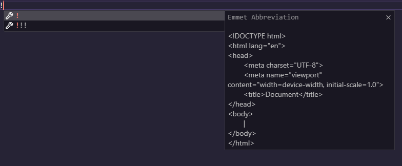
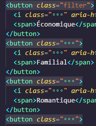
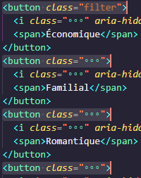
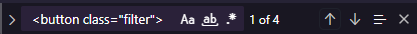
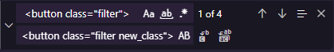
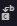
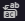
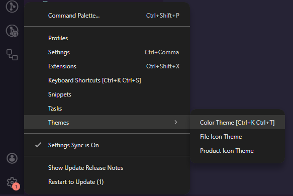

# Petites astuces des familles

## Raccourcis

### !

Si tu appuie sur ! en haut d'une page VS Code va te faire une suggestion comme ça :

Cela permet d'avoir instantanément la structure HTML si tu sélectionne la première suggestion.

### Emmet abbreviation

Si tu as déjà en tête la structure du'une partie de ton site tu peux l'écrire d'un coup grâce aux Emmets abbreviations, elles apparaissent dès que tu commence à écrire du code pour te suggérer le code que tu cherche à écrire.

Ex :

### CTRL+d :

Si tu veux modifier plusieurs éléments pareils et que tu veux gagner du temps tu peux sélectionner le prmier élément et faire `CTRL+d`. Cela va sélectionner le même élément mais juste en-dessous, si continue à faire `CTRL+d` ou a maintenir la commande ça va continuer a sélectionner. Tu peux voir que ça à marché car il y a plusieurs curseurs. Une fois que tout est sélectionner tu peux écrire le code que tu veux et il s'écrira sur toutes les lignes sélectionnées, tu as plusieurs curseurs.

Ex :

| Avant `CTRL+d`                          | Après `CTRL+d`                            |
| --------------------------------------- | ----------------------------------------- |
|  |  |

### CTRL+f :

Dans le même esprit et que tu aurais trop d'éléments à sélectionner (c'est comme ça que je l'utilise) tu peux faire `CTRL+f` sur le premier élément, ce qui va rechercher dans toute la page l'élément sélectionné. En plus de ça `CTRL+f` va ouvrir une petite fenêtre qui va t'aider a remplacer d'un coup tout les élément trouvé ou juste un avec le texte que tu auras renseigné.

Ex :
Je veux ajouter une classe à tous les `<button class="filter">`, je fait `CTRL+f` sur le premier et j'ai cette fenêtre :

Je vois que j'ai 4 `<button class="filter">`, je peux naviguer entre eux avec les flêches de droite et les surligner avec les 3 barres.
Pour ajouter une classe j'appuie sur la flêche de gauche, la fenêtre s'agrandie et je peux écrire le texte de remplacement :

Pour appliquer le remplacement je peux appuiyer sur  ce qui va seulement remplacer le premier élément ou j'appuie sur  qui va remplacer tous les élément en même temps.

### CTRL+/ :

Faire `CTRL+/` dans une ligne de code va transformer ce code en commentaire (n'importe quel code). Ce qui est pratique pour ne pas avoir à se rappeler des différentes manière pour commenter en fonction des différents fichiers de code. Cela va également créer un espace de commentaire vide si la ligne n'a pas de code.

Ex :

### Select+balise

Si tu veux mettre des guillemets (ou autre) plus rapidement tu peux sélectionner le code/texte que tu veux et appuier sur les guillemets et ça va les entourer automatiquement.

Ex : 

### ALT+z :

Si ton code est trop long est que n'arrive pas à tout voir sans scroller sur le côté fait `ALT+z` et le code trop long par rapport à ton écran ira à la ligne. Cela n'a pas d'incidence sur le rendu.

## Extensions

Une lise d'extensions sympa pour VS Code. Pour rechercher et installer une extension il faut cliquer sur une icone qui ressemble à ça :, ça peux changer en fonction du thème installé.

- **Prettier - Code formatter**
  > Va formatter ton code afin de le rendre plus agréable à la lecture, dès que tu sauvegarde.
- **Inline fold**
  > Permet de transformer la partie class="" et de la rendre plus petite ex : avant => `<button class="filter button button-red">` après => `<button class="...">`
- **Auto Close Tag**
  > Tout est dans le nom, ça va fermer automatiquement les balise HTML
- **Auto Rename Tag**
  > Si tu modifie une balise ça va automatiquement modifier la balise de fermetur sans que tu ais à décendre
- **Better Comments**
  > Pour personnaliser la couleur de tes commentaires, si tu l'installe tu verra mieux où j'ai fait les modifs
- **className Completion in CSS**
  > Suggère des classes CSS dans le fichier de style qui ont déjà été utilisées dans le fichier ou les classes mises en place dans le HTML si le HTML est dans le même dossier.
- **colorize**
  > Affiche la couleur à côté du code couleur quand tu en écris un.
- **Excalidraw**
  > Une extension qui permet de faire des shcéma et des dessins.
- **JavaScript (ES6) code snippets**
  > Fourni différent raccourci pour écrire des formule javascript.
- **Tailwind CSS IntelliSense**
  > Très pratique si tu utilise Tailwindcss

## Thèmes et icones

Pas indispensable mais je te donne les icones et le thème que j'utilise :

- Thème : **Synthwave 84**
- Icônes : **Catppuccin Icons for VSCode** et plus précisément _Catppuccin Frappé_

Pour rechercher installer des thèmes et des icône c'est au même endroit que pour les extensions. Si tu veux changer ton thème ou tes icônes il faut aller dans les paramètre en bas à gauche et cliquer sur Themes puis sélectionner ce que tu veux modifier entre le theme de couleur et les icônes :

